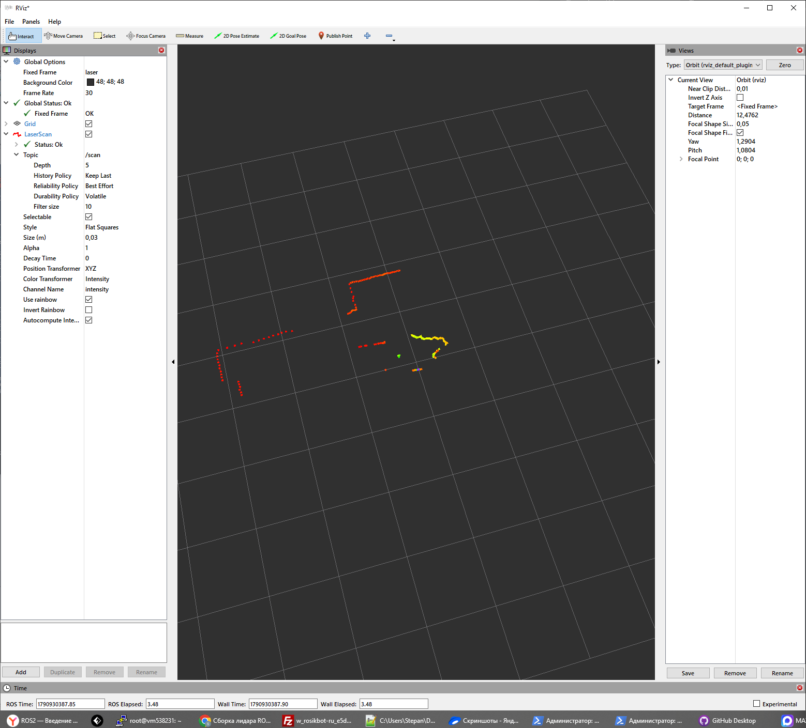

# ROSiK LiDAR UART

Готовый проект для работы с круговым лидаром ROSiK через ESP32, Python и ROS 2 Jazzy.

ESP32 принимает пакеты лидара, управляет 8-секторным светодиодным кольцом и передаёт на компьютер полный 360° скан с расстояниями и нативной интенсивностью отражения. На компьютере данные можно смотреть в автономном Python-визуализаторе или публиковать в ROS 2 как `sensor_msgs/LaserScan` и отображать в RViz2.

## Что получится

- полный круговой скан 360°;
- расстояния в метрах;
- нативная интенсивность отражения;
- цветная визуализация в Python;
- топик ROS 2 `/scan`;
- цветная визуализация интенсивности в RViz2;
- 8-секторное RGB-кольцо на ESP32;
- проверка UART/CRC и сопоставления scan + intensity отдельным тестом.

## ROSiK и лидар


Робот ROSiK: https://rosikbot.ru/robots/rosik/

Лидар установлен сверху робота и используется для кругового измерения расстояний, визуализации в RViz, построения карт и дальнейших экспериментов с мобильной робототехникой.

## Как выглядит результат

### Python-визуализатор


### ROS 2 + RViz2, окраска по интенсивности



### Светодиодное кольцо


Исходное видео: [`assets/media/lidar_ring_demo.mp4`](assets/media/lidar_ring_demo.mp4)

---

# С чего начать

## 1. Подключить лидар к ESP32

Основные подключения:

| Устройство | ESP32 | Примечание |
|---|---:|---|
| TX лидара | GPIO16 | RX2 ESP32 |
| RX лидара | GPIO17 | обычно не используется лидаром |
| WS2812, DATA | GPIO14 | кольцо из 8 светодиодов |
| дополнительный mask UART | GPIO4 | опционально |
| GND | GND | общая земля обязательна |

Подробно: [`docs/01_ESP32_И_ПОДКЛЮЧЕНИЕ.md`](docs/01_ESP32_%D0%98_%D0%9F%D0%9E%D0%94%D0%9A%D0%9B%D0%AE%D0%A7%D0%95%D0%9D%D0%98%D0%95.md)

## 2. Прошить ESP32

Открыть в Arduino IDE:

```text
firmware/rosik_lidar_uart/rosik_lidar_uart.ino
```

Нужна библиотека **FastLED** и установленная поддержка ESP32 для Arduino IDE.

После прошивки ESP32 передаёт данные компьютеру через основной `Serial` на скорости **460800 бод**.

## 3. Сначала проверить железо без ROS

Установить Python-зависимости:

```bash
pip install -r requirements.txt
```

Windows:

```powershell
python tools\hardware_smoke.py COM6 --seconds 10
```

Linux:

```bash
python3 tools/hardware_smoke.py /dev/ttyUSB0 --seconds 10
```

Хороший результат заканчивается строками:

```text
[PASS] distance scan transport is stable.
[PASS] intensity companion packets are stable.
```

Подробно: [`docs/02_PYTHON_И_ПРОВЕРКА.md`](docs/02_PYTHON_%D0%98_%D0%9F%D0%A0%D0%9E%D0%92%D0%95%D0%A0%D0%9A%D0%90.md)

## 4. Посмотреть лидар в Python

Windows:

```powershell
python tools\lidar_viewer.py COM6 --color-by intensity
```

Linux:

```bash
python3 tools/lidar_viewer.py /dev/ttyUSB0 --color-by intensity
```

Для окраски по расстоянию:

```powershell
python tools\lidar_viewer.py COM6 --color-by distance
```

## 5. Выбрать свою инструкцию ROS 2

### Windows 10

[`docs/03_ROS2_WINDOWS10.md`](docs/03_ROS2_WINDOWS10.md)

В инструкции отдельно разобраны `pixi`, PowerShell, `local_setup.ps1`, сборка `colcon` и запуск RViz.

Установка ROS 2 под Windows 10 также подробно разобрана в уроке курса:
https://stepik.org/lesson/2012052/step/1?unit=2040279

### Ubuntu 24.04 + ROS 2 Jazzy

[`docs/04_ROS2_UBUNTU.md`](docs/04_ROS2_UBUNTU.md)

### Windows 10 + WSL2

[`docs/05_ROS2_WSL.md`](docs/05_ROS2_WSL.md)

Там отдельно разобраны проброс USB/COM в WSL и запуск RViz.

## 6. RViz2

Готовая конфигурация находится здесь:

```text
ros2_ws/src/rosik_lidar/rviz/lidar.rviz
```

Основные параметры LaserScan:

```text
Topic: /scan
Reliability Policy: Best Effort
Durability Policy: Volatile
Color Transformer: Intensity
Channel Name: intensity
```

Подробно: [`docs/06_RVIZ.md`](docs/06_RVIZ.md)

---

# Структура репозитория

```text
ROSiK_LiDAR/
├── README.md
├── requirements.txt
├── firmware/
│   └── rosik_lidar_uart/
│       └── rosik_lidar_uart.ino
├── tools/
│   ├── hardware_smoke.py
│   └── lidar_viewer.py
├── ros2_ws/
│   └── src/
│       └── rosik_lidar/
│           ├── config/
│           │   └── lidar.yaml
│           ├── launch/
│           │   └── lidar.launch.py
│           ├── rosik_lidar/
│           │   ├── protocol.py
│           │   ├── serial_io.py
│           │   ├── ros_node.py
│           │   └── viewer.py
│           └── rviz/
│               └── lidar.rviz
├── docs/
├── tests/
└── assets/
```

## Где что искать

| Задача | Файл / каталог |
|---|---|
| Прошить ESP32 | `firmware/rosik_lidar_uart/rosik_lidar_uart.ino` |
| Проверить UART и intensity | `tools/hardware_smoke.py` |
| Посмотреть лидар без ROS | `tools/lidar_viewer.py` |
| ROS 2 пакет | `ros2_ws/src/rosik_lidar/` |
| Параметры ROS-ноды | `ros2_ws/src/rosik_lidar/config/lidar.yaml` |
| Запуск через `ros2 launch` | `ros2_ws/src/rosik_lidar/launch/lidar.launch.py` |
| Готовый RViz | `ros2_ws/src/rosik_lidar/rviz/lidar.rviz` |
| Подключение ESP32 | `docs/01_ESP32_И_ПОДКЛЮЧЕНИЕ.md` |
| Python и аппаратный тест | `docs/02_PYTHON_И_ПРОВЕРКА.md` |
| Windows 10 | `docs/03_ROS2_WINDOWS10.md` |
| Ubuntu | `docs/04_ROS2_UBUNTU.md` |
| WSL | `docs/05_ROS2_WSL.md` |
| RViz | `docs/06_RVIZ.md` |
| UART-протокол | `docs/07_UART_ПРОТОКОЛ.md` |
| Типовые проблемы | `docs/08_ДИАГНОСТИКА.md` |
| Автотесты | `docs/09_ТЕСТЫ.md` |

---

# Быстрый запуск ROS 2

После установки ROS 2 и сборки workspace:

```bash
ros2 run rosik_lidar rosik_lidar_node --ros-args -p port:=/dev/ttyUSB0
```

Windows:

```powershell
ros2 run rosik_lidar rosik_lidar_node --ros-args -p port:=COM6
```

Проверка:

```bash
ros2 topic hz /scan
```

Проверка intensity:

```bash
ros2 topic echo /scan --once --field intensities --qos-reliability best_effort --qos-durability volatile
```

Запуск готового launch-файла с RViz:

```bash
ros2 launch rosik_lidar lidar.launch.py port:=/dev/ttyUSB0 rviz:=true
```

Windows:

```powershell
ros2 launch rosik_lidar lidar.launch.py port:=COM6 rviz:=true
```

---

# Полезные материалы

**ROSiK — реальный робот с лидаром, камерой и ROS 2**  
https://rosikbot.ru/robots/rosik/

**ROSiK LAB — бесплатный браузерный симулятор**  
https://rosikbot.ru/lab/

В ROSiK LAB можно в упрощённом виде работать с мобильным роботом, двигаться по полю и читать виртуальные датчики, включая лидар.

**Бесплатный курс «ROS2 — Введение в робототехнику»**  
https://stepik.org/course/221157/syllabus

**Установка ROS 2 под Windows 10**  
https://stepik.org/lesson/2012052/step/1?unit=2040279

---

# Рекомендуемый порядок работы

1. Подключить лидар и LED-кольцо к ESP32.
2. Прошить `rosik_lidar_uart.ino`.
3. Закрыть Arduino Serial Monitor.
4. Запустить `hardware_smoke.py`.
5. Убедиться, что CRC = 0 и intensity сопоставляется со сканом.
6. Запустить `lidar_viewer.py`.
7. Только после этого переходить к ROS 2.
8. Собрать пакет `rosik_lidar`.
9. Проверить `/scan` через `ros2 topic echo` или `ros2 topic hz`.
10. Запустить RViz2 и включить окраску по `Intensity`.

Если что-то не работает, идти по диагностике: [`docs/08_ДИАГНОСТИКА.md`](docs/08_%D0%94%D0%98%D0%90%D0%93%D0%9D%D0%9E%D0%A1%D0%A2%D0%98%D0%9A%D0%90.md).
