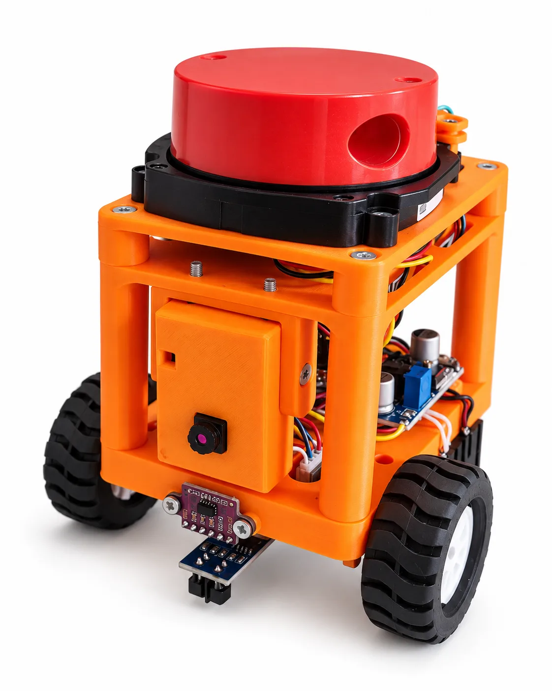
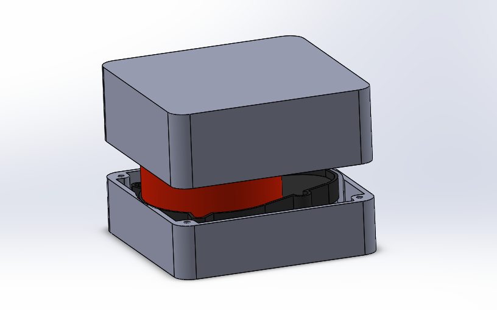
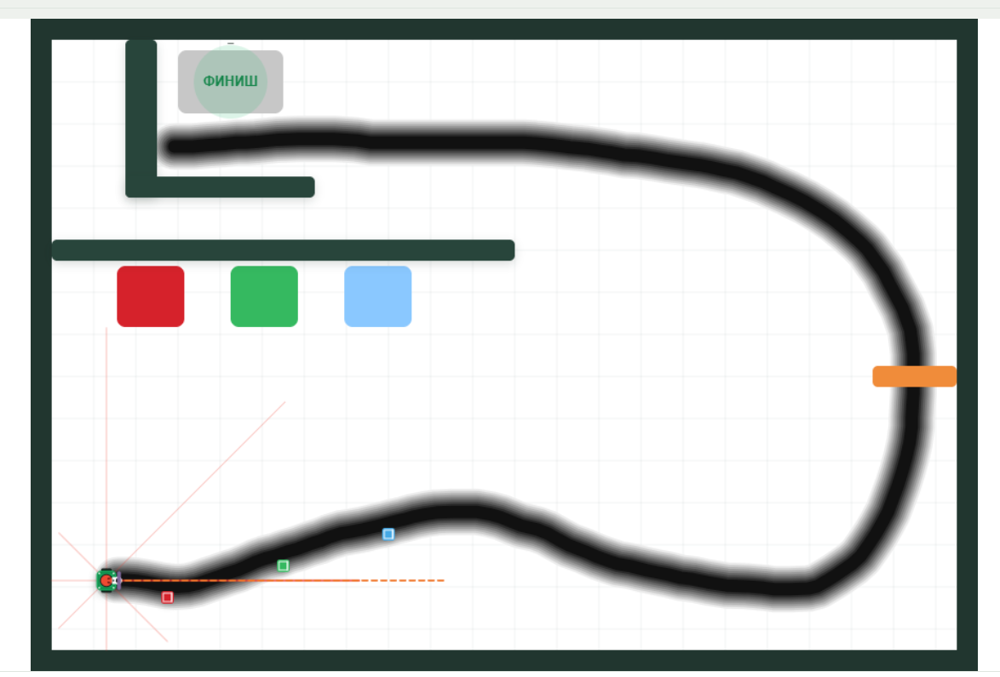

# ROSiK LiDAR

Практический проект для работы с круговым лидаром на **ESP32**: от первого чтения сырых байтов до цветной визуализации в Python и публикации `sensor_msgs/LaserScan` в **ROS2 Jazzy / RViz2**.

В репозитории собраны:

- простая прошивка для первой проверки лидара;
- прошивка для светодиодного кольца и восьмисекторной маски;
- полноценный UART-мост ESP32 → компьютер;
- Python-тест аппаратного тракта;
- Python-визуализатор;
- ROS2-пакет `rosik_lidar`;
- готовая конфигурация RViz2;
- подробные инструкции для Windows 10, Ubuntu 24.04 и WSL2.



Робот ROSiK: [rosikbot.ru/robots/rosik](https://rosikbot.ru/robots/rosik/)  
Исходники робота: [github.com/stepanburmistrov/ROSik](https://github.com/stepanburmistrov/ROSik)

---

# 1. Структура репозитория

```text
ROSiK_LiDAR/
├── README.md
├── requirements.txt
│
├── firmware/
│   ├── 01_raw_sniff/
│   │   ├── README.md
│   │   └── RosikLidarRawSniff.ino
│   │
│   ├── 02_ring_mask/
│   │   ├── README.md
│   │   └── RosikLidarRingMask.ino
│   │
│   └── rosik_lidar_uart/
│       ├── README.md
│       └── rosik_lidar_uart.ino
│
├── tools/
│   ├── hardware_smoke.py
│   └── lidar_viewer.py
│
├── ros2_ws/
│   └── src/
│       └── rosik_lidar/
│           ├── config/lidar.yaml
│           ├── launch/lidar.launch.py
│           ├── rosik_lidar/
│           ├── rviz/lidar.rviz
│           ├── package.xml
│           └── setup.py
│
├── docs/
│   ├── 01_ESP32_И_ПОДКЛЮЧЕНИЕ.md
│   ├── 02_PYTHON_И_ПРОВЕРКА.md
│   ├── 03_ROS2_WINDOWS10.md
│   ├── 04_ROS2_UBUNTU.md
│   ├── 05_ROS2_WSL.md
│   ├── 06_RVIZ.md
│   ├── 07_UART_ПРОТОКОЛ.md
│   ├── 08_ДИАГНОСТИКА.md
│   └── 09_ТЕСТЫ.md
│
├── tests/
└── assets/
```

## Куда идти

| Что хотите сделать | Куда перейти |
|---|---|
| Впервые подключить лидар и убедиться, что он выдаёт данные | [`firmware/01_raw_sniff/`](firmware/01_raw_sniff/README.md) |
| Подключить кольцо WS2812 и получить маску 8 секторов | [`firmware/02_ring_mask/`](firmware/02_ring_mask/README.md) |
| Передавать полный скан на компьютер | [`firmware/rosik_lidar_uart/`](firmware/rosik_lidar_uart/README.md) |
| Проверить ESP32 и UART без ROS2 | [`tools/hardware_smoke.py`](tools/hardware_smoke.py) |
| Посмотреть точки в Python | [`tools/lidar_viewer.py`](tools/lidar_viewer.py) |
| Запустить ROS2 под Windows 10 | [`docs/03_ROS2_WINDOWS10.md`](docs/03_ROS2_WINDOWS10.md) |
| Запустить ROS2 под Ubuntu 24.04 | [`docs/04_ROS2_UBUNTU.md`](docs/04_ROS2_UBUNTU.md) |
| Запустить ROS2 в WSL2 | [`docs/05_ROS2_WSL.md`](docs/05_ROS2_WSL.md) |
| Настроить RViz2 | [`docs/06_RVIZ.md`](docs/06_RVIZ.md) |
| Разобраться с UART-протоколом | [`docs/07_UART_ПРОТОКОЛ.md`](docs/07_UART_ПРОТОКОЛ.md) |
| Что-то не работает | [`docs/08_ДИАГНОСТИКА.md`](docs/08_ДИАГНОСТИКА.md) |

---

# 2. Первый запуск: просто прочитать данные лидара

Если лидар подключается впервые, не начинайте с ROS2. Сначала убедитесь, что сам датчик и UART работают.

Используйте минимальную прошивку:

**[`firmware/01_raw_sniff/RosikLidarRawSniff.ino`](firmware/01_raw_sniff/RosikLidarRawSniff.ino)**  
Подробная инструкция: **[`firmware/01_raw_sniff/README.md`](firmware/01_raw_sniff/README.md)**

## Подключение лидара к ESP32

| Лидар | ESP32 |
|---|---|
| TX | GPIO16 / RX2 |
| RX | GPIO17 / TX2, обычно не требуется |
| GND | GND |
| Питание | согласно требованиям вашего модуля |

UART лидара: **115200 бод**.

После прошивки откройте Serial Monitor на 115200 бод. В потоке должны регулярно встречаться байты:

```text
55 AA 03 08
```

Это заголовок исходного 36-байтового пакета лидара.

## Структура исходного пакета

```text
55 AA 03 08                    4 байта  заголовок
speed                          2 байта
start_angle                    2 байта
point[0] ... point[7]         24 байта  8 × (distance uint16 + intensity uint8)
end_angle                      2 байта
tail                           2 байта  служебное поле
```

Каждая точка содержит:

```text
distance   uint16 little-endian, мм
intensity  uint8
```

Угол:

```text
angle_deg = (raw_angle - 0xA000) / 64
```

В пакете 8 точек, включая начальный и конечный угол, поэтому промежуточные углы распределяются через `/ 7`.

Полное описание первого запуска находится на странице [прошивки Raw Sniff](firmware/01_raw_sniff/README.md).

---

# 3. Светодиодное кольцо и маска 8 секторов

Следующий вариант работы вообще не требует компьютера или ROS2.

Прошивка:

**[`firmware/02_ring_mask/RosikLidarRingMask.ino`](firmware/02_ring_mask/RosikLidarRingMask.ino)**  
Подробное описание: **[`firmware/02_ring_mask/README.md`](firmware/02_ring_mask/README.md)**

Она делит пространство на **8 секторов по 45°** и показывает состояние на восьми светодиодах WS2812.


По умолчанию:

- красный — препятствие ближе 150 мм;
- жёлтый — препятствие ближе 300 мм;
- зелёный — сектор свободен или объект дальше 300 мм.

## Дополнительный выход для простого робота

Эта же прошивка раз в 100 мс отправляет через `GPIO4` один байт — **маску опасных секторов**:

```text
bit 0 → сектор 0
bit 1 → сектор 1
...
bit 7 → сектор 7
```

Например:

```text
00000101
```

означает препятствия в секторах `0` и `2`.

Такой режим удобно использовать на простом роботе с **Arduino, ESP8266, вторым ESP32 или другим контроллером**: контроллеру не нужно разбирать полный поток лидара — достаточно одного байта с восьмью направлениями.

Подробности схемы, порогов и формата маски: [README прошивки Ring Mask](firmware/02_ring_mask/README.md).

---

# 4. Корпус лидара для робота и Eurobot

Для лидара есть отдельная 3D-модель защитного корпуса/крепления, которую можно использовать на соревновательном роботе.



Файлы модели находятся здесь:

[github.com/stepanburmistrov/ROS2_robotV1/tree/main/3D/red_lidar_box](https://github.com/stepanburmistrov/ROS2_robotV1/tree/main/3D/red_lidar_box)

Полезные ссылки по соревнованиям **Eurobot Russia**:

- сайт: [eurobot.ru](https://eurobot.ru/)
- Telegram: [t.me/eurobot_russia](https://t.me/eurobot_russia)
- MAX: [max.ru/channel_eurobot](https://max.ru/channel_eurobot)

---

# 5. Проверка и визуализация в Python

Для полноценной работы с компьютером прошейте ESP32 основной прошивкой:

**[`firmware/rosik_lidar_uart/rosik_lidar_uart.ino`](firmware/rosik_lidar_uart/rosik_lidar_uart.ino)**  
Описание прошивки: **[`firmware/rosik_lidar_uart/README.md`](firmware/rosik_lidar_uart/README.md)**

Она передаёт на компьютер:

- полный скан 360°;
- расстояния;
- нативную интенсивность отражения;
- номер скана и timestamp;
- CRC16;
- при этом продолжает управлять кольцом и может выдавать 8-секторную маску.

## Установка Python-зависимостей

Из корня репозитория:

```bash
pip install -r requirements.txt
```

## Сначала аппаратный тест

Код теста: **[`tools/hardware_smoke.py`](tools/hardware_smoke.py)**

Windows:

```powershell
python tools\hardware_smoke.py COM6 --seconds 10
```

Ubuntu / Linux:

```bash
python3 tools/hardware_smoke.py /dev/ttyUSB0 --seconds 10
```

Хороший результат:

```text
[PASS] distance scan transport is stable.
[PASS] intensity companion packets are stable.
```

## Визуализатор

Код: **[`tools/lidar_viewer.py`](tools/lidar_viewer.py)**

Windows:

```powershell
python tools\lidar_viewer.py COM6 --color-by intensity
```

Linux:

```bash
python3 tools/lidar_viewer.py /dev/ttyUSB0 --color-by intensity
```


Можно переключить раскраску с интенсивности на расстояние:

```powershell
python tools\lidar_viewer.py COM6 --color-by distance
```

Подробная инструкция: [`docs/02_PYTHON_И_ПРОВЕРКА.md`](docs/02_PYTHON_И_ПРОВЕРКА.md).

---

# 6. Подключение к ROS2

После проверки Python можно переходить к ROS2.

Пакет находится здесь:

**[`ros2_ws/src/rosik_lidar/`](ros2_ws/src/rosik_lidar/)**

Он публикует:

```text
/scan    sensor_msgs/msg/LaserScan
```

В сообщении доступны и расстояния, и интенсивности:

```text
ranges[]
intensities[]
```

## Бесплатный курс ROS2

Если ROS2 ещё незнаком, можно пройти бесплатный курс:

**[ROS2 — Введение в робототехнику на Stepik](https://stepik.org/course/221157/syllabus)**

Для Windows 10 в курсе есть отдельный урок по установке:

**[Установка ROS2 под Windows](https://stepik.org/lesson/2012052/step/1?unit=2040279)**

## Инструкции по операционным системам

### Windows 10

**[`docs/03_ROS2_WINDOWS10.md`](docs/03_ROS2_WINDOWS10.md)**

В инструкции разобраны:

- ROS2 Jazzy в Windows;
- `pixi`;
- PowerShell;
- правильное подключение `local_setup.ps1`;
- сборка `colcon`;
- COM-порт;
- запуск ноды и RViz2.

### Ubuntu 24.04

**[`docs/04_ROS2_UBUNTU.md`](docs/04_ROS2_UBUNTU.md)**

### WSL2

**[`docs/05_ROS2_WSL.md`](docs/05_ROS2_WSL.md)**

В том числе описан проброс USB/COM-порта из Windows в WSL.

## Быстрый запуск ноды

Windows:

```powershell
ros2 run rosik_lidar rosik_lidar_node --ros-args -p port:=COM6
```

Ubuntu / WSL:

```bash
ros2 run rosik_lidar rosik_lidar_node --ros-args -p port:=/dev/ttyUSB0
```

Проверка:

```bash
ros2 topic hz /scan
```

Проверка интенсивности:

```bash
ros2 topic echo /scan --once --field intensities \
  --qos-reliability best_effort \
  --qos-durability volatile
```

## RViz2

Готовый конфиг:

**[`ros2_ws/src/rosik_lidar/rviz/lidar.rviz`](ros2_ws/src/rosik_lidar/rviz/lidar.rviz)**

Основные настройки:

```text
Topic: /scan
Reliability Policy: Best Effort
Durability Policy: Volatile
Color Transformer: Intensity
Channel Name: intensity
```


Подробно: [`docs/06_RVIZ.md`](docs/06_RVIZ.md).

---

# 7. Полезные материалы

## ROSiK

ROSiK — мобильный робот, на котором можно использовать этот лидар, камеру, ROS2, SLAM и автономную навигацию.

- страница робота: [rosikbot.ru/robots/rosik](https://rosikbot.ru/robots/rosik/)
- GitHub робота: [github.com/stepanburmistrov/ROSik](https://github.com/stepanburmistrov/ROSik)


## ROSiK LAB — симулятор

Перед работой с реальным роботом часть алгоритмов можно попробовать прямо в браузере:

**[rosikbot.ru/lab](https://rosikbot.ru/lab/)**

В симуляторе есть упрощённая модель мобильного робота и лидара, поэтому удобно знакомиться с принципом работы дальномера, объездом препятствий и навигационными алгоритмами.



## Курс ROS2

Бесплатный курс:

**[stepik.org/course/221157/syllabus](https://stepik.org/course/221157/syllabus)**

---

# Документация

| Раздел | Ссылка |
|---|---|
| ESP32 и подключение | [`docs/01_ESP32_И_ПОДКЛЮЧЕНИЕ.md`](docs/01_ESP32_И_ПОДКЛЮЧЕНИЕ.md) |
| Python, тест и визуализация | [`docs/02_PYTHON_И_ПРОВЕРКА.md`](docs/02_PYTHON_И_ПРОВЕРКА.md) |
| ROS2 Jazzy / Windows 10 | [`docs/03_ROS2_WINDOWS10.md`](docs/03_ROS2_WINDOWS10.md) |
| ROS2 Jazzy / Ubuntu | [`docs/04_ROS2_UBUNTU.md`](docs/04_ROS2_UBUNTU.md) |
| ROS2 Jazzy / WSL2 | [`docs/05_ROS2_WSL.md`](docs/05_ROS2_WSL.md) |
| RViz2 | [`docs/06_RVIZ.md`](docs/06_RVIZ.md) |
| UART-протокол ESP32 → компьютер | [`docs/07_UART_ПРОТОКОЛ.md`](docs/07_UART_ПРОТОКОЛ.md) |
| Диагностика | [`docs/08_ДИАГНОСТИКА.md`](docs/08_ДИАГНОСТИКА.md) |
| Автотесты | [`docs/09_ТЕСТЫ.md`](docs/09_ТЕСТЫ.md) |

---

# Рекомендуемый порядок работы

Для первого знакомства лучше идти именно так:

```text
1. Raw Sniff
      ↓
2. Убедиться, что 55 AA 03 08 стабильно приходит
      ↓
3. Кольцо WS2812 / маска 8 секторов
      ↓
4. Полная прошивка UART-моста
      ↓
5. hardware_smoke.py
      ↓
6. lidar_viewer.py
      ↓
7. ROS2 /scan
      ↓
8. RViz2
      ↓
9. SLAM, навигация и работа на ROSiK
```

Если на каком-либо шаге что-то не работает, не переходите дальше — используйте [`docs/08_ДИАГНОСТИКА.md`](docs/08_ДИАГНОСТИКА.md).
