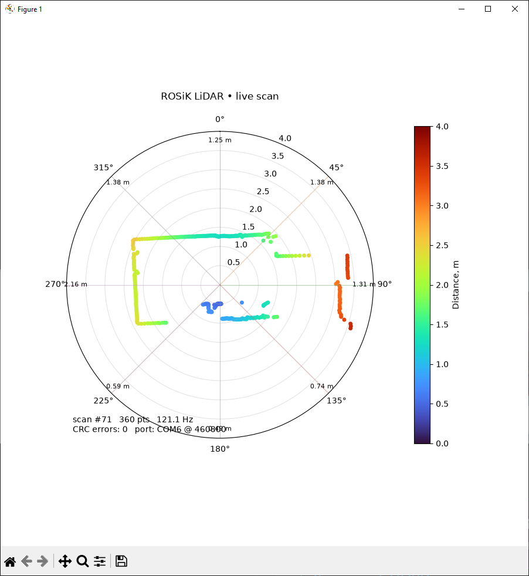
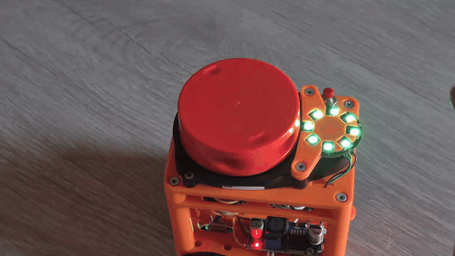

# ROSiK LiDAR UART

A ready-to-use repository for the ROSiK 2D LiDAR path:

**LiDAR -> ESP32 -> binary UART/USB -> Python viewer or ROS 2 Jazzy `/scan`**

It also keeps the original **8-sector WS2812 ring** behaviour and the optional one-byte alarm mask output.

## What is included

- `firmware/rosik_lidar_uart/` — ESP32 firmware: LiDAR parser, ring, full-scan collection, UART framing + CRC.
- `tools/lidar_viewer.py` — standalone live polar visualizer for Windows/Linux, no ROS required.
- `ros2_ws/src/rosik_lidar/` — ROS 2 `ament_python` package publishing `sensor_msgs/LaserScan` and a static `base_link -> laser` TF.
- `rviz/lidar.rviz` — ready RViz2 view.
- `tests/` — protocol/parser tests.
- `docs/` — wiring and binary protocol.

## Media / examples

### Python live viewer screenshot



### LED ring demo GIF



Original video is also included: `assets/media/lidar_ring_demo.mp4`

## Platform-specific launch guides

- `docs/RUN_UBUNTU_JAZZY.md` — Ubuntu 24.04 + ROS 2 Jazzy + RViz2.
- `docs/RUN_WINDOWS10_JAZZY.md` — Windows 10 + ROS 2 Jazzy + RViz2.
- `docs/RUN_WSL_WINDOWS10_JAZZY.md` — WSL2 on Windows 10, COM/USB forwarding + RViz2 via X server.

## 1. Flash the ESP32

Open:

`firmware/rosik_lidar_uart/rosik_lidar_uart.ino`

Arduino dependencies:

- ESP32 Arduino core
- FastLED

Default pins:

- LiDAR RX: GPIO16
- LiDAR TX: GPIO17 (usually unused)
- WS2812 ring: GPIO14
- optional sector-mask TX: GPIO4

The host serial stream is binary at **460800 baud**. Do **not** add `Serial.print()` diagnostics to the firmware unless you disable the binary host stream.

## 2. Standalone Python visualizer

### Windows

```powershell
cd ROSiK_Lidar_UART
py -m venv .venv
.venv\Scripts\activate
pip install -r requirements.txt
python tools\lidar_viewer.py COM5
```

### Linux

```bash
cd ROSiK_Lidar_UART
python3 -m venv .venv
source .venv/bin/activate
pip install -r requirements.txt
python3 tools/lidar_viewer.py /dev/ttyUSB0
```

If there is exactly one serial device, you may omit the port. Useful options:

```bash
python3 tools/lidar_viewer.py /dev/ttyUSB0 --max-range 6
python3 tools/lidar_viewer.py /dev/ttyUSB0 --offset 180
python3 tools/lidar_viewer.py /dev/ttyUSB0 --no-mirror
```

The default orientation (`mirror=true`, `offset=180°`) is carried over from the existing ROSiK bridge. If the physical LiDAR is mounted differently, tune these two values.

## 3. ROS 2 Jazzy installation

Assumes Ubuntu 24.04 + ROS 2 Jazzy.

```bash
sudo apt update
sudo apt install -y ros-jazzy-desktop python3-serial python3-colcon-common-extensions
source /opt/ros/jazzy/setup.bash
cd ROSiK_Lidar_UART/ros2_ws
rosdep install --from-paths src --ignore-src -r -y
colcon build --symlink-install
source install/setup.bash
```

Give your user access to serial ports if required:

```bash
sudo usermod -aG dialout $USER
```

Log out/in once after changing the group.

## 4. Run the ROS 2 driver

Direct node:

```bash
ros2 run rosik_lidar rosik_lidar_node --ros-args -p port:=/dev/ttyUSB0
```

Launch file:

```bash
ros2 launch rosik_lidar lidar.launch.py port:=/dev/ttyUSB0
```

Start the driver and the supplied RViz view together:

```bash
ros2 launch rosik_lidar lidar.launch.py port:=/dev/ttyUSB0 rviz:=true
```

Check data:

```bash
ros2 topic hz /scan
ros2 topic echo /scan --once
ros2 run tf2_ros tf2_echo base_link laser
```

## 5. RViz2 (Jazzy)

After building and sourcing the workspace:

```bash
rviz2 -d $(ros2 pkg prefix rosik_lidar)/share/rosik_lidar/rviz/lidar.rviz
```

The supplied RViz config already has:

- **Fixed Frame**: `base_link`
- **LaserScan** display
- **Topic**: `/scan`
- **Style**: `Points`
- top-down view

If you configure RViz manually:

1. `Global Options -> Fixed Frame = base_link` (or `laser` if you disable static TF).
2. `Add -> By display type -> LaserScan`.
3. Set `Topic = /scan`.
4. Set `Reliability Policy = Best Effort` if RViz does not display points with the default QoS.
5. Use `TopDownOrtho` for the clearest 2D view.

## 6. ROS parameters

Defaults are in `ros2_ws/src/rosik_lidar/config/lidar.yaml`.

Important parameters:

- `port`: `/dev/ttyUSB0`
- `baud`: `460800`
- `frame_id`: `laser`
- `base_frame`: `base_link`
- `lidar_xyz`: sensor position in metres
- `mirror`: default `true`
- `angle_offset_deg`: default `180.0`
- `range_min`, `range_max`
- `scan_bins`: default `360`, giving an exactly uniform ROS `LaserScan`

Example:

```bash
ros2 run rosik_lidar rosik_lidar_node --ros-args \
  -p port:=/dev/ttyUSB0 \
  -p mirror:=false \
  -p angle_offset_deg:=0.0 \
  -p lidar_xyz:="[0.05, 0.0, 0.12]"
```

## Design notes / fixes versus the supplied sources

- Uses the reliable full-revolution accumulation idea from `full_firmware.ino`, but sends it over UART instead of WebSocket.
- Preserves the 8-sector ring and one-byte mask idea from `RosikLidarRingMask.ino`.
- Uses endpoint interpolation `i/7` for 8 samples between start/end angles.
- Detects 360° wrap **before** appending the new revolution's first fragment; this avoids mixing the first packet of the next turn into the previous scan.
- Host transport has magic, length, sequence, timestamp and CRC16, so both Python and ROS can recover from partial/noisy serial reads.
- ROS output is resampled onto 360 uniform angular bins. This matches the semantics expected by `sensor_msgs/LaserScan` better than declaring a uniform increment while retaining irregular native angles.
- No fake `map -> odom` transform is published. A standalone LiDAR driver should publish only its own sensor transform; mapping/navigation owns the rest of the TF tree.

## Test

Protocol tests do not require hardware:

```bash
python3 -m pytest -q
```

Hardware smoke test:

1. Start the Python viewer and rotate/place flat objects around the LiDAR.
2. Confirm all eight ring sectors correspond to the expected direction.
3. Confirm `CRC errors` stays at 0 during normal operation.
4. Run `ros2 topic hz /scan` and verify a stable scan frequency.
5. Open the included RViz config and compare point orientation with the real room.

If the scan is mirrored or rotated, change `mirror` and `angle_offset_deg`; do not rewrite the packet parser.
